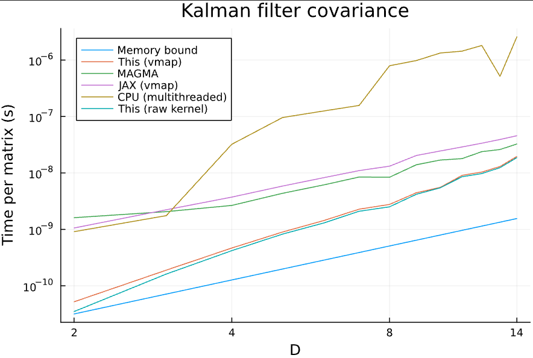

+++
date = '2025-12-30'
draft = false
title = '[Masters Project] GPU-Optimised Linear Algebra for Small Matrices'
featuredImage = "thumb.png"
+++

Repo (my supervisor's GitHub):
[Github – BatchedKernels.jl](https://github.com/THargreaves/BatchedKernels.jl)

My master's project focuses on accelerating linear algebra operations on large batches
of small matrices using GPUs. This implementation outperforms state-of-the-art
libraries such as JAX by as much as 30x.

---

# Overview

Modern GPU-accelerated libraries are primarily optimised for large matrices, as large
matrices typically come with larger workloads, and GPU parallelisation is more necessary.

However, there are use cases where operations on large batches of small matrices are performed,
and due to the large batch sizes, the overall workloads may still be significant. When
performing operations on small matrices, existing libraries do not fully utilise the hardware's
capabilities, and if the batch size is large enough, existing implementations may be
prohibitively slow.

This project investigates, designs, and implements a hardware-aware GPU execution model for
large batches of small-matrix operations, optimised for multi-step algorithms, starting from
my supervisor's proof-of-concept. This is made accessible for regular users via automatic
GPU kernel generation similar to JAX `vmap`.

---

# Achieved performance

The figure below shows the average per-matrix computation time for different matrix dimensions
D, for a dummy algorithm (Kalman filter covariance update was used here), and compares
it against other state-of-the-art implementations.

Compared to existing implementations:
- 2.5x – 30x speedup over JAX `vmap`
- 2x – 45x speedup over MAGMA (a C++ library for optimised batched small-matrix operations)
- 10x – 300x speedup over a 48-core multithreaded CPU-implementation

---

# Technical background

The key to achieving such speed is exploiting the fact that very small matrices allow entire
matrices to reside in GPU shared memory, across different operations during multi-step
algorithms. This allows data reuse and avoids global memory traffic for intermediate results.
For sufficiently small matrices, this is actually the dominant cost, especially for multi-step
algorithms.

Furthermore, each GPU warp can be assigned exclusive responsibility for a fixed group of
matrices, which makes the whole execution completely warp-independent. Shared memory is also
separated to regions, each region only accessed by one warp. As a result, warps never need
to be synchronised, even across multiple operations. This allows for highly efficient
kernel fusion.

To make this as efficient as possible, the shared memory layout is carefully designed to
guarantee bank-conflict-free accesses for both row-wise and column-wise matrix operations.
This is achieved by having one thread process a full row/column instead of one element.
This is made possible by designing the shared memory to store matrices in an interleaved
manner (1st element of matrix 1, 1st element of matrix 2, ...) instead of each matrix
contiguously. Alongside appropriate padding, this also ensures each warp accesses
distinct memory banks during a lockstep, allowing maximum shared memory bandwidth,
essential to achieving near-optimal performance.

To make this accessible, I implemented a lightweight compiler that automatically generates
specialised, fused kernels. Without this, users would have to manually implement any custom
algorithm using low-level batched primitives, requiring careful reasoning about
warp-level execution and the shared memory layout. This is exposed to users via a familiar
JAX `vmap`-like interface, allowing users to write ordinary functions while benefitting
from highly specialised hardware-aware kernels.

This project is implemented in Julia and CUDA.jl.

## Ongoing work & roadmap

Over the remainder of the academic year, I am continuing to extend this project, primarily
focusing on adding support for more linear algebra operations. So far only the operations
involved in the Kalman filter have been implemented.
