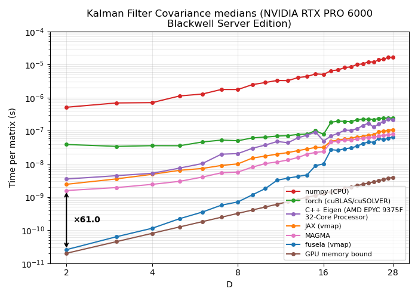
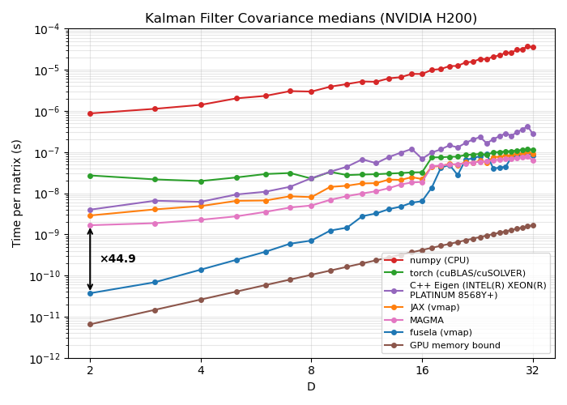
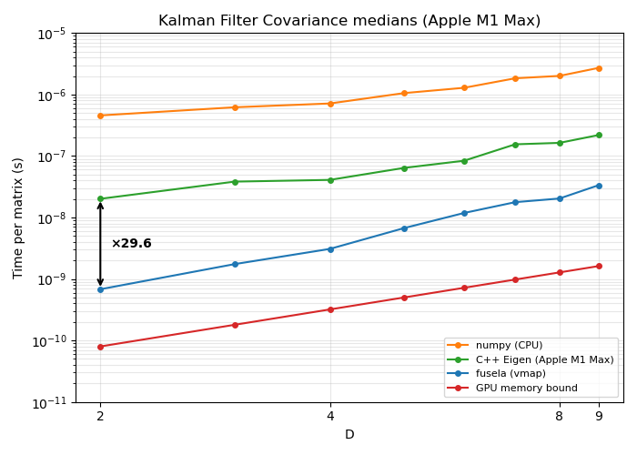

+++
date = '2026-04-22'
draft = false
title = '[Masters Project] GPU-Optimised Linear Algebra for Small Matrices'
featuredImage = "thumb.png"
+++

My master's project: a GPU library for accelerating linear algebra operations on large batches of
small matrices. Achieves up to ~90x speedup over state-of-the-art libraries such as MAGMA and JAX.

---

# Overview

Modern GPU-accelerated libraries are built for large matrices, where each operation carries enough
work to saturate the hardware on its own. In many applications, though, the workload is instead a
very large batch of small matrices, a pattern common in particle filters, Kalman methods, and parts of ML.
Here, the existing libraries fail to fully utilise the GPU, and at sufficiently large batch sizes,
runtime becomes prohibitively slow.

This project designs and implements a hardware-aware GPU execution model, specialised for large batches
of small matrices, and particularly effective for multi-step algorithms. It is packaged as a library,
`fusela`, which exposes the underlying execution model through automatic kernel generation
with a JAX `vmap`-like interface. Users write ordinary per-matrix functions, and `fusela`
compiles them into specialised fused and batched kernels.

---

# Performance

The figures below show the median per-matrix computation time across different matrix dimensions D,
measured on a multi-step algorithm (a single Kalman filter covariance update step, ~10 matrix operations),
compared against other implementations.

### Consumer GPU (NVIDIA RTX 6000 Pro)

Compared to existing implementations:
- Up to 94x speedup over JAX `vmap`
- Up to 61x speedup over MAGMA (a C++ library for optimised batched small-matrix operations)
- Up to ~100x speedup over multithreaded CPU (C++ Eigen library)

### Datacentre GPU (NVIDIA H200)

Compared to existing implementations:
- Up to 77x speedup over JAX `vmap`
- Up to 45x speedup over MAGMA (a C++ library for optimised batched small-matrix operations)
- Up to ~100x speedup over multithreaded CPU (C++ Eigen library)

### Apple Silicon (M1 Pro, Metal backend)

- Up to ~30x speedup over multithreaded CPU (C++ Eigen library)

GPU comparisons on Apple Silicon are limited, as there are no complete existing
GPU implementations for batched small-matrix linear algebra.
